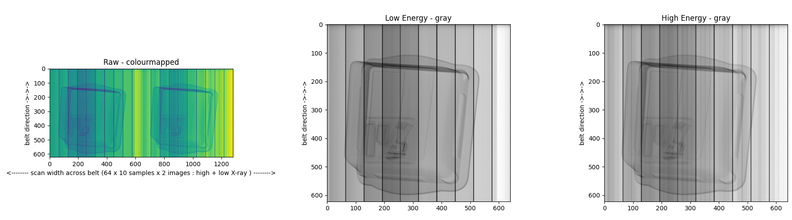

# Read VOTI Detection Raw X-ray Data Format Files

a simple script to read the raw data format exported from VOTI Detection X-ray Scanners (.voti files)

## Data Format
- filename is of the format: ``SERIAL-DATE-TIME-VIEW.voti`` (e.g.  ``001234-20230630-160512-0.voti``) 
- 32-bit unsigned integer, no file header
- data comprises 2 images of same view at different energy levels (i.e. raw dual-energy X-ray response - high and low X-ray images)
- images resolution in px is _[ 640 x  L ]_, where _L_ is the length of the item in scanlines passing through the X-ray beam and is variable dependent on the item being scanned

## Usage

Tested using Python 3.11.

``
python3 -m pip install -r requirements.txt
python3 ./read-voti.py filename.voti
``

## Observations

- data is uncorrected 64 x 10 samples from X-ray detector (in x-axis across beam)
- every 10th sample appears to be missing (unknown if this is specific issue with scanner tested or general)
- data aquisation appears to start before X-ray beam is fully active and is still energising (i.e. first N image rows contain no data / gradient in X-ray intensity, N = 30 in examples tested - unknown if this is specific issue with scanner tested or general).
- effective-Z data is not present or stored in this file format
